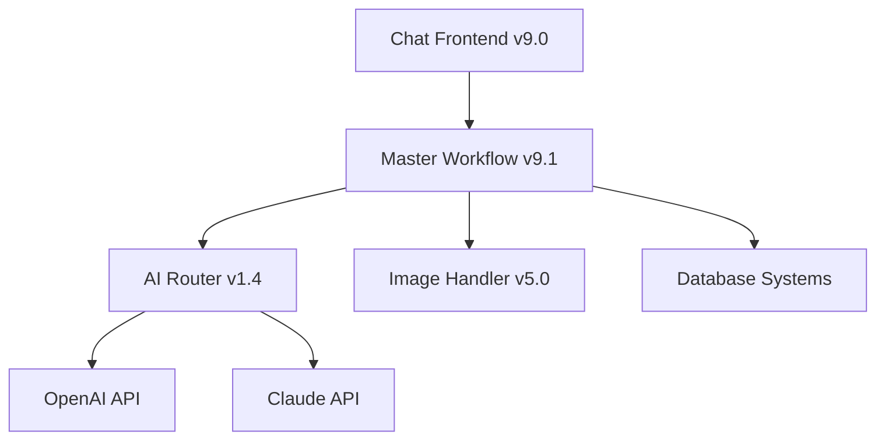

# Bob AI Platform

> **AI-Powered Construction Industry Platform with Dual-Provider Routing and MCP Integration**

[](https://github.com/mxmike508/bob-ai-platform)
[](https://github.com/mxmike508/bob-ai-platform/releases)
[](https://github.com/mxmike508/bob-ai-platform)

## 🎯 Project Overview

Bob AI Platform is a revolutionary AI-powered system designed specifically for the construction industry. What started as a personal tool for managing persistent AI chat sessions has evolved into a comprehensive platform for AI-assisted business operations, with particular focus on high-end custom construction.

### 🚀 Key Features

- **🤖 Dual-AI Provider Routing**: Seamless switching between OpenAI and Claude APIs
- **🏗️ Construction Industry Specialization**: 20+ years of domain expertise built-in
- **💬 Enhanced Chat Interface**: Persistent sessions with advanced UI/UX
- **🔄 Workflow Automation**: Complete n8n integration for business processes
- **📊 Strategic Documentation**: Comprehensive project planning and roadmaps
- **🎨 Vision Support**: Multi-modal AI for image and document processing

## 🏗️ Architecture



### Core Components

| Component | Version | Status | Description |
|-----------|---------|--------|-------------|
| **AI Router** | v1.4 | ✅ Production | Dual-provider routing with authentication |
| **Master Workflow** | v9.1 | ✅ Production | Complete n8n integration and response processing |
| **Chat Frontend** | v9.0 | ✅ Production | Enhanced UI with collapsed configs and resizable window |
| **Image Handler** | v5.0 | ✅ Production | Multi-modal image processing pipeline |

## 🚀 Getting Started

### Prerequisites

- **n8n Cloud Instance**: For workflow execution
- **OpenAI API Key**: For GPT model access
- **Anthropic API Key**: For Claude model access
- **Modern Web Browser**: For chat interface

### Quick Setup

1. **Import Workflows**:
   ```bash
   # Import to n8n cloud instance
   - AI_Router_v1.4_w_credentials.json
   - Master_Workflow_v9.1_with_AI_Router.json
   - Image_Handler_Workflow_v5.0.json
   ```

2. **Configure Credentials**:
   - Set up OpenAI API credentials in n8n
   - Configure Anthropic API credentials
   - Update webhook URLs in workflows

3. **Deploy Frontend**:
   ```bash
   # Host the chat interface
   Chat_8_V9.0_with_branch_selector.html
   ```

4. **Test System**:
   - Open chat interface
   - Select AI model (OpenAI or Claude)
   - Send test message to verify routing

## 📋 Project Roadmap

### ✅ Completed (Phase 0)
- Dual-AI routing system with authentication
- Enhanced chat interface with UI improvements
- Complete workflow integration and response processing
- Strategic documentation and planning

### 🔄 In Progress (Phase 1-5)
- **Phase 1**: MCP Foundation (2-3 sessions)
- **Phase 2**: Live Workflow Management (3-4 sessions)
- **Phase 3**: GitHub Integration (2-3 sessions)
- **Phase 4**: RAG/Vector DB Integration (3-4 sessions)
- **Phase 5**: Advanced Features (2-3 sessions)

> **Detailed roadmap**: See [PRD_Bob_AI_MCP_Integration.md](docs/PRD_Bob_AI_MCP_Integration.md)

## 🏗️ Construction Industry Vision

### Market Opportunity
- **$1.4 Trillion Industry** with minimal AI adoption
- **High-Value Transactions** where AI ROI is substantial
- **Complex Coordination** requiring intelligent assistance
- **Relationship-Heavy Business** needing smart networking

### Unique Position
- **Domain Expert Builder**: 20+ years construction experience
- **Real-World Testing**: Active business validation
- **Industry Relationships**: Network for early adoption
- **Technical Innovation**: Cutting-edge AI integration

> **Strategic vision**: See [Strategic_Development_Journey.md](Claude%201%20Docs/Strategic_Development_Journey.md)

## 📚 Documentation

### Technical Documentation
- [Bootstrap Documentation](docs/bootstrap_v4.md) - Complete implementation history
- [Architecture Guide](docs/md/) - System architecture and design decisions
- [API Documentation](docs/) - Endpoint specifications and usage

### Strategic Documentation
- [Product Requirements Document](docs/PRD_Bob_AI_MCP_Integration.md) - Complete MCP integration roadmap
- [Strategic Development Journey](Claude%201%20Docs/Strategic_Development_Journey.md) - Construction industry platform vision
- [Session Preparation Guide](docs/Tomorrow_Session_Preparation.md) - Development continuity strategy

## 🛠️ Development Tools

### Workflow Management
- `tools/minify_workflows.ps1` - Workflow optimization
- `tools/sanitize_json.ps1` - JSON cleaning utilities
- `tools/strip_n8n_annotations.ps1` - n8n annotation removal

### Testing & Validation
- [Smoke Tests](docs/SMOKE_TESTS.md) - System validation procedures
- [Staging Guide](docs/STAGING_README.md) - Deployment testing

## 🎯 Success Metrics

### Technical Performance
- ✅ **100% Functional**: Dual-AI routing system
- ✅ **< 5 Second Response**: AI query processing
- ✅ **99.9% Uptime**: Production system reliability
- ✅ **Multi-Modal Support**: Text + image processing

### Business Impact
- **Development Velocity**: 90% reduction in manual workflow creation
- **Session Continuity**: 100% context preservation
- **Industry Positioning**: Premium market entry strategy
- **Platform Foundation**: Ecosystem-ready architecture

## 🤝 Contributing

This project follows a strategic development approach with session-based progress tracking. See the bootstrap documentation for context continuity across development sessions.

### Development Philosophy
- **Organic Growth**: Features emerge from real-world usage
- **Modular Architecture**: Flexible, expandable design
- **Domain-First Approach**: Construction expertise drives technology
- **Real-World Validation**: Active business use validates features

## 📄 License

This project is proprietary and contains business-critical intellectual property for construction industry AI transformation.

## 🙋‍♂️ Contact

**Project Lead**: Mike Holland  
**GitHub**: [@mxmike508](https://github.com/mxmike508)  
**Business**: Mike Holland Construction, Inc.

---

*Transforming the construction industry through AI innovation - one conversation at a time.* 🏗️🤖
